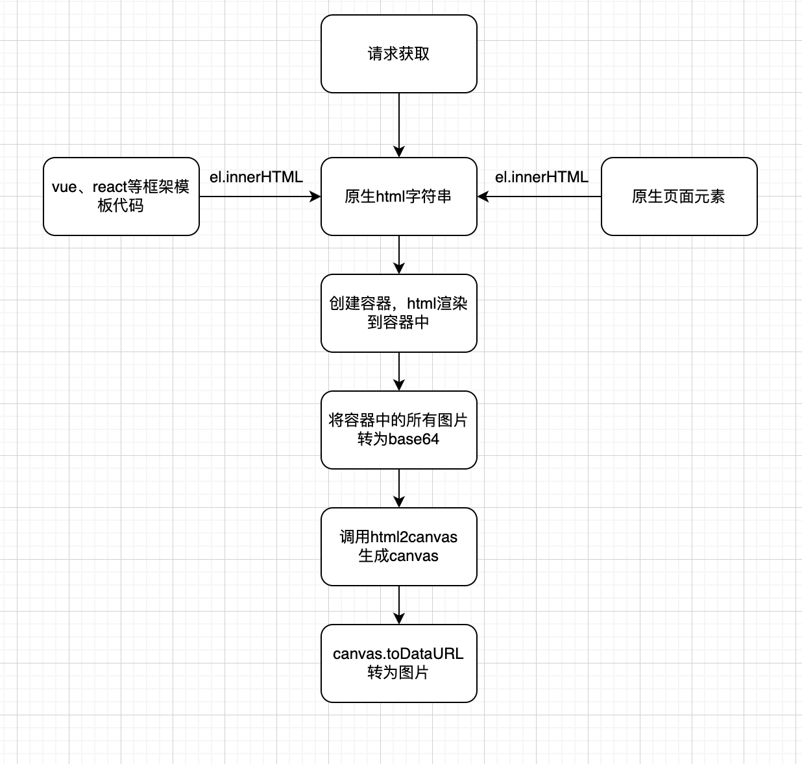

## HTML转图片功能
### 功能概述
将一段原生html转为图片

### 应用场景
- 页面保存为图片、分享等
- 电子证书、证明、发票等
- 页面截屏

### 外部依赖
- [html2canvas](https://html2canvas.hertzen.com/)

### 实现方案


### 具体代码
```typescript
import html2canvas from 'html2canvas';

const convertImgToBase64 = (url: string, outputFormat = 'image/png') => {
  // 创建canvas 用于绘制图片
  const canvas = document.createElement('canvas');
  const ctx = canvas.getContext('2d')!;

  return new Promise<string>((resolve, reject) => {
    // 创建img
    const img = new Image();
    // 关键：可跨域属性
    img.crossOrigin = 'anonymous';
    // 图片加载后在canvas上绘制图片并转为DataURL
    img.onload = () => {
      canvas.height = img.height;
      canvas.width = img.width;
      ctx.drawImage(img, 0, 0);
      const dataURL = canvas.toDataURL(outputFormat);
      resolve(dataURL);
    };
    img.onerror = reject;
    // 给src属性赋值 触发onload
    img.src = url;
  });
};

const htmlToCanvas = async (htmlStr: string) => {
  // 创建盒子 把证书html字符串填入
  const certBox = document.createElement('div');
  // 创建一个避免样式污染的盒子，.pure-box中把默认标签样式重置
  certBox.className = 'pure-box';
  certBox.innerHTML = htmlStr;
  // 不让用户看到这个盒子
  certBox.style.position = 'fixed';
  certBox.style.left = '9999px';
  certBox.style.top = '9999px';

  // 这里只写了一个子元素，如果有多个需要遍历
  const htmlEl = certBox.children[0] as HTMLDivElement;

  // 获取包含图片的元素，这里建议修改为匹配图片的正则匹配
  const newImgEls = htmlEl.querySelectorAll<HTMLImageElement>('.img-el');

  // 获取证书内所有的url
  const newImgs = Array.from(newImgEls).map((img) => img.src);

  // 转为对应base64的dataURL
  const dataURLs = await Promise.all(newImgs.map((url) => convertImgToBase64(url)));

  // 替换证书内的图片url为dataURL
  certBg && (htmlEl.style.backgroundImage = `url("${dataURLs[0]}")`);
  [...Array.from(imgs1), ...Array.from(imgs2), ...Array.from(newImgEls)].forEach((el, i) => {
    el.src = dataURLs[i + 1];
  });

  // 获取行内样式中的宽高
  const windowWidth = isNaN(parseInt(htmlEl.style.width, 10))
    ? window.innerWidth
    : parseInt(htmlEl.style.width, 10);
  const windowHeight = isNaN(parseInt(htmlEl.style.height, 10))
    ? window.innerHeight
    : parseInt(htmlEl.style.height, 10);

  document.body.appendChild(certBox);

  // 生成证书的canvas
  const canvas = await html2canvas(htmlEl, {
    windowWidth,
    windowHeight,
    scale: 1,
    useCORS: true, // 此参数很重要，不然不加载base64图片
    allowTaint: true,
  });

  // 移除盒子
  document.body.removeChild(certBox);

  // 返回canvas元素 和base64图片
  return {
    canvas,
    base64: canvas.toDataURL('image/png')
  };
};
```

### 注意事项
注意转为canvas时的页面标签样式，html中的class是否污染。确保转化时容器中显示的html与页面上显示一致
