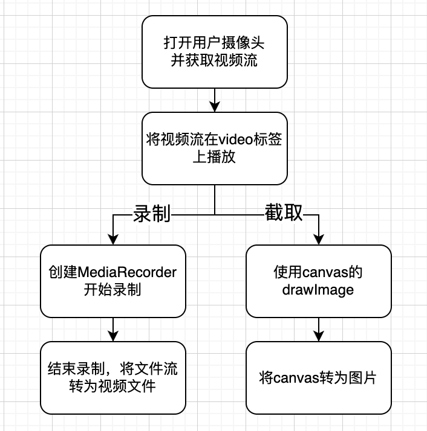

## 摄像头的录屏截屏

### 功能概述

打开用户摄像头、对摄像头做录制、截取操作

### 应用场景

- 监考
- 人脸识别
- 直播

### 实现方案



### 具体代码

```typescript
let cameraStreamRef
const video = document.createElement('video')
document.body.appendChild(video)

// 打开用户摄像头
const openUserCamera = async () => {
  // 检查浏览器是否支持getUserMedia API
  if (navigator.mediaDevices && navigator.mediaDevices.getUserMedia) {
    // 请求用户授权访问摄像头
    try {
      const cameraStream = await navigator.mediaDevices.getUserMedia({
        video: true,
      })
      return cameraStream
    } catch (error) {
      console.log('摄像头访问失败，摄像头可能被禁用，请授权访问摄像头')
    }
  } else {
    console.log('浏览器或非https协议地址不支持getUserMedia API')
  }
  return undefined
}

// 开启摄像头视频
const openCameraVideo = async () => {
  const cameraStream = await openUserCamera(staticLinks?.cameraHelpDocUrl || '')
  if (cameraStream) {
    cameraStreamRef = cameraStream
    // 播放摄像头的视频流
    video.srcObject = cameraStream
    video.play()
  }
}

// 开启视频监控
const enableCameraSurveillance = async () => {
  // 录制
  const chunks: Blob[] = []
  let mediaRecorder: MediaRecorder

  const startRecording = () => {
    if (!cameraStreamRef) return

    mediaRecorder = new MediaRecorder(cameraStreamRef, {
      videoBitsPerSecond: 128000,
    })

    mediaRecorder.ondataavailable = (e) => {
      chunks.push(e.data)
    }

    mediaRecorder.onstop = async () => {
      // 兼容性的问题 最好用webm
      const file = new File(chunks, `${Date.now()}.webm`, {
        type: 'video/webm',
      })
      // 得到了视频文件后，可以做一些操作
      // ...
    }

    // 开始录制
    mediaRecorder.start()
  }

  const stopRecording = () => {
    // 停止录制
    mediaRecorder.stop()
    chunks.length = 0
  }

  // 开始首次录制
  startRecording()

  // 每30秒录制一段
  interruptRecord()
  recordTimer.current = setInterval(() => {
    stopRecording() // 停止上一次的录制
    startRecording() // 开始新的录制
  }, 30 * 1000)
}

const videoCapture = () => {
  const canvas = document.createElement('canvas')
  const ctx = canvas.getContext('2d')

  canvas.width = video.videoWidth
  canvas.height = video.videoHeight

  ctx.drawImage(video, 0, 0, canvas.width, canvas.height)

  const imageData = canvas.toDataURL('image/png')
  // 得到了base64图片后，可以做一些操作
}
```

### 注意事项

1. 用户可能会拒绝获取摄像头权限，需要手动打开权限
2. 用户自身电脑可能没有摄像头或摄像头硬件、驱动错误
